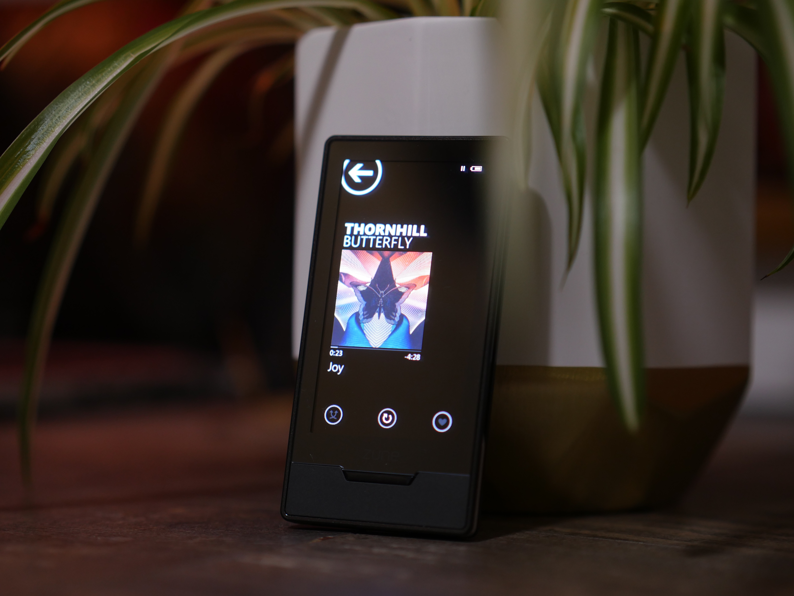

# Atlas
Welcome, Argonauts!

For a guide on how to install the OpenZDK click [here](../Zune%20devices/Apps/OpenZDK/Setup.md).

## Topics
- [OpenZDK](../Zune%20devices/Apps/OpenZDK/index.md)
- [OpenGL ES](../Zune%20devices/Zune%20HD/OpenGL%20ES.md)
- [Official Documentation](./Official%20Documentation.md)
- [Windows CE 6.0](../Zune%20devices/Zune%20HD/Windows%20CE%206.0.md)
- [File Types](./File%20Types.md)
- [XNA Framework](../Zune%20devices/Apps/XNA%20Framework/index.md)

