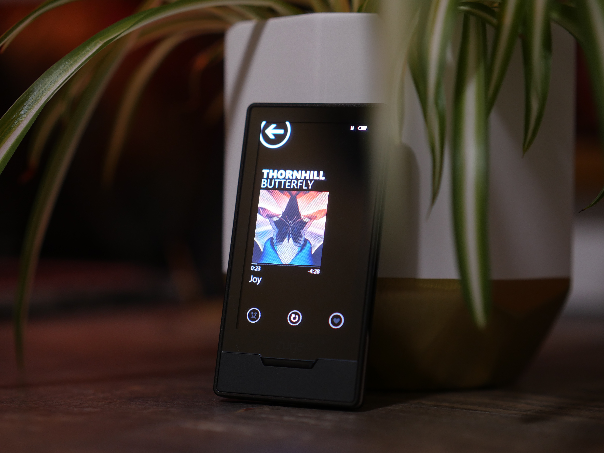

# Zune HD

The Zune HD was released on September 15, 2009 and was the last Zune to be released by Microsoft. The device is codenamed "Pavo".

## Hardware
* CPU: Nvidia Tegra APX 2600
    * ARM11 + ARM7 cores
    * ARMv6 ISA
* Graphics: OpenGL ES 2.0
* RAM: 128MB SDRAM
* User storage: 16/32/64GB flash
    * Toshiba TH58NVG8D2ELA89 64GB
* Display: 3.3" touchscreen
    * 480×272px
    * OLED
    * Multitouch
* Connectivity
    * Wi-Fi 802.11b/g WPA/WPA2
    * USB 2.0
    * MTPZ (Media Transport Protocol with proprietary Zune extensions and signing)

## Procedures

### Device recovery and reset
Holding the side button down during boot will put the device into system recovery, which allows the Zune software to update the firmware.

Holding both the side and front buttons will irreversibly wipe the device of all data.

### Media library dump
The device's media library, including Marketplace data such as artist images and biographys, can be dumped to a file on the host machine by setting a specific registry key.

1. Navigate to `HKEY_CURRENT_USER\Software\Microsoft\Zune\Devices`.
2. Create a string key named `ZMDBSaveToFile`.
3. Set the key to the file path you wish to save to. Ensure that backslashes are escaped with a second backslash (e.g. `C:\Users\you\zune.zmdb` becomes `C:\\Users\\you\\zune.zmdb`).
4. Plug in your device and launch the Zune software.

The resulting file is stored in the ZMDB format, for which no tools currently exist. 

## References 
- [Wikipedia Zune HD](https://en.wikipedia.org/wiki/Zune_HD)
